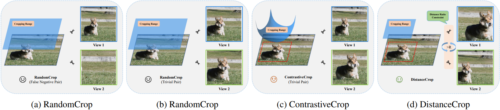

# DistanceCrop
A PyTorch implementation of paper
__"Rethinking Image Cropping for Contrastive Learning"__
<!-- >University of Chinese Academy of Sciences, Renmin University of China, Institute of Computing Technology, Chinese Academy of Sciences -->

## Abstract
The accomplishment of contrastive learning has stimulated critical breakthroughs in unsupervised representation learning. 
The research of contrastive learning principally includes the selection of sample pairs, the construction of the feature encoder and the design of the contrastive loss. 
From a methodological perspective, most of the researchers who neither consider the semantic information contained in the image nor the semantic information diversity between pairs, choose a simple RandomCrop when selecting sample pairs, to generate the positive pairs forthright.
We argue that generating positive pairs should not be two independent cropping processes.
For this reason, we technically put forward the DistanceCrop method, which enriches the semantic information diversity by bringing in the conception of distance ratio constraint. 
The DistanceCrop restricts the similarity of the positive pairs between the centroid distance of the cropping boxes and the diagonal distance of the localization bounding boxes.
It is worth noting that besides CNN, we embed DistanceCrop into the famous ViT architecture.
We utilize the Recursive Attention Score (RAS) to directly implement semantic-aware localization in the encoder of ViT with marginal overhead.
We also observe that there are inevitably hard examples generated by the randomness of the image cropping methods.
Thus, we propose a contrastive loss with an adaptive temperature $\tau$ which can control the degree of the focus on each sample pair flexibly. 
Last but not least, we conduct extensive experiments on many classical datasets and tasks with DistanceCrop.
The linear classification accuracy increases 0.10\% - 4.33\% on CIFAR-10, CIFAR-100, STL-10 and Tiny ImageNet.

<!-- ## Illustration of different image cropping methods -->

> The complete code will be released after the paper is accepted.
